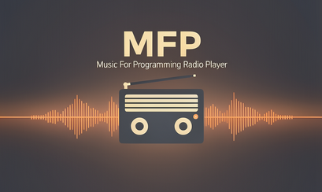

# MFP - Music For Programming Radio Player

Lightweight Rust player for [Music For Programming](https://musicforprogramming.net/) radio.



## Features

- **Real progressive streaming** - Starts playing after only 512KB buffer
- **Interactive progress bar** - Displays elapsed time, remaining time, and playback percentage
- **Complete playback controls** - Pause/resume, volume (+/-), mute (m), info (i)
- **Offline download system** - Download episodes to listen without connection
- Persistent favorites system
- Shuffle mode
- Simple and fast CLI interface
- **Non-blocking interactive controls** - Instant navigation between episodes
- Optimized and lightweight binary (3.6 MB)
- **Low-level audio playback** - No external dependencies (doesn't require mpv, ffmpeg, etc.)
- Native decoding of MP3, FLAC, WAV, Vorbis, AAC, ALAC and more formats
- **Background download** - Audio downloads while playing

## Installation

```bash
cargo build --release
```

The optimized binary will be at `target/release/mfp`.

### Optional system installation

```bash
sudo cp target/release/mfp /usr/local/bin/
```

## Usage

### List episodes
```bash
mfp list
```

### Play
```bash
# From the first episode
mfp play

# Specific episode
mfp play -e 75

# With shuffle
mfp play -s

# Favorites only
mfp play -f

# Favorites with shuffle
mfp play -f -s
```

### Manage favorites
```bash
# List favorites
mfp fav -l

# Add favorite
mfp fav -a "Episode 75: Datassette"

# Remove favorite
mfp fav -r "Episode 75: Datassette"
```

### Manage offline downloads
```bash
# Download a specific episode
mfp download -e 75

# List downloaded episodes
mfp download --list

# View used space
mfp download --size

# Delete a downloaded episode
mfp download --delete "Episode 75"
```

Episodes are downloaded to `~/.config/mfp/downloads/`

## Playback controls

During playback you'll see an interactive progress bar:
```
[03:45/58:23] ━━━━━━━━━━━━━━━━━━━━━━━━━━━━━━━━━━━━━━━━━━ 6% | -54:38 >
```

Available controls:
- `n` or `next` - Next episode
- `b` or `back` - Previous episode
- `p` or `pause` - Pause/resume playback
- `+` or `up` - Increase volume
- `-` or `down` - Decrease volume
- `m` or `mute` - Mute/unmute
- `i` or `info` - Show current episode information
- `s` or `shuffle` - Toggle shuffle
- `f` or `favorite` - Toggle current episode favorite
- `d` or `download` - Download current episode for offline
- `q` or `quit` - Exit

## Architecture

The project is organized into modules:

- `feed.rs` - RSS feed parser
- `player.rs` - Low-level audio streaming and playback engine
- `playlist.rs` - Playlist and shuffle management
- `favorites.rs` - Persistent favorites system
- `downloader.rs` - Offline download system
- `main.rs` - CLI and main logic

### Progressive Streaming System

The player uses a **separate threads** architecture for efficient streaming:

```
┌─────────────────────────────────────────────────────┐
│                   Main Thread                        │
│                 (User Interface)                     │
└─────────────────────────────────────────────────────┘
                          │
                          ├──► Navigation control (n/p/s/f/q)
                          │
         ┌────────────────┴────────────────┐
         │                                  │
┌────────▼─────────┐              ┌────────▼──────────┐
│ Download Thread  │              │  Playback Thread  │
│                  │              │                    │
│ • Downloads 32KB │──── Channel ─►│ • 512KB Buffer   │
│   chunks         │   (mpsc)     │ • Decoding        │
│ • HTTP streaming │              │ • Rodio playback  │
│ • Non-blocking   │              │                   │
└──────────────────┘              └───────────────────┘
```

**Key features:**
- **Initial buffer**: 512KB (~1-2 seconds wait)
- **Chunks**: Downloads in 32KB blocks
- **Fast cancellation**: Threads stop without blocking
- **Memory efficient**: Continuous streaming, doesn't load entire file

## Main dependencies

- `rodio` + `symphonia` - Low-level audio playback and decoding (pure Rust)
- `reqwest` - HTTP client for fetching RSS feed and audio streams
- `rss` - XML feed parser
- `clap` - CLI framework with arguments
- `serde` + `serde_json` - Favorites serialization
- `anyhow` - Improved error handling
- `rand` - Random generation for shuffle
- `dirs` - System configuration paths

## Configuration

- Favorites: `~/.config/mfp/favorites.json`
- Offline downloads: `~/.config/mfp/downloads/`

## Build optimizations

The project uses aggressive optimizations in release mode:

```toml
[profile.release]
opt-level = "z"      # Optimize for size
lto = true           # Link-Time Optimization
codegen-units = 1    # Better optimization
strip = true         # Remove debug symbols
```

This results in a very small and efficient binary.

## How it works

### Playback flow

1. **Episode fetching**: Downloads and parses the RSS feed from musicforprogramming.net

2. **Playlist management**: Episodes are organized in a list that can be sequential or random

3. **Progressive audio streaming**:
   ```
   User presses Play
   ↓
   📡 Connecting... (Download thread starts)
   ↓
   ⏳ Buffering... (Accumulates initial 512KB)
   ↓
   ✓ (Decodes MP3/FLAC/etc with Symphonia)
   ↓
   ▶️ Playback starts (Playback thread)
   ↓
   🎵 Audio plays while continuing to download in background
   ```

4. **Non-blocking cancellation system**:
   - When you press `n` (next), the audio sink stops instantly
   - Download and playback threads terminate automatically
   - No waits or blocks - immediate navigation

5. **Persistence**: Favorites are saved in JSON format at `~/.config/mfp/favorites.json`

6. **Interactivity**: The program reads user commands in real-time without interfering with playback

## Troubleshooting

### mfp command not found
Make sure the binary is in your PATH or use the full path: `./target/release/mfp`

### Error: "Could not initialize audio device"
- Verify that your system has an audio device configured
- On Linux, make sure ALSA or PulseAudio are running
- Check audio device access permissions

### No audio during playback
- Check your system volume
- Verify the correct audio device is selected
- On Linux: Verify ALSA/PulseAudio are configured correctly
- Review your system audio configuration

### Navigation (n/p) feels slow
- This is normal on slow connections during initial buffering
- The system waits for 512KB before starting playback
- Once playback starts, navigation is instant

### Network error or interrupted download
- The player automatically handles network errors
- If download fails, simply press `n` for next episode
- Threads clean up automatically without leaving resources hanging

## Technologies used

- **[Rust](https://www.rust-lang.org/)** - Programming language
- **[Rodio](https://github.com/RustAudio/rodio)** - High-level audio library
- **[Symphonia](https://github.com/pdeljanov/Symphonia)** - Pure Rust audio decoder
- **[Reqwest](https://github.com/seanmonstar/reqwest)** - HTTP client for streaming
- **[Clap](https://github.com/clap-rs/clap)** - CLI argument parser

## Resources

- [Music For Programming](https://musicforprogramming.net/) - Official radio site
- [RSS Feed](https://musicforprogramming.net/rss.xml) - Feed used by the player

## Performance

- **Binary**: 3.6 MB (optimized release)
- **Memory**: ~10-20 MB during playback (streaming buffer)
- **Startup**: ~1-2 seconds (initial 512KB buffering)
- **CPU**: Low consumption (~2-5% on modern systems)
- **Network**: Progressive download, doesn't require downloading entire file

## License

GNU General Public License v3.0
