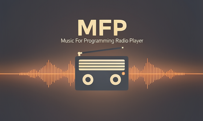

# MFP — Music For Programming Player

Lightweight Rust terminal player for [musicforprogramming.net](https://musicforprogramming.net/).

**[→ Documentation & full feature overview](https://4DRIAN0RTIZ.github.io/mfp/)**



## Install

```bash
git clone https://github.com/4DRIAN0RTIZ/mfp && cd mfp
cargo build --release
sudo cp target/release/mfp /usr/local/bin/  # optional
```

## Usage

```bash
mfp play            # play from the start
mfp play -e 75      # specific episode
mfp play -s         # shuffle
mfp play -f         # favorites only
mfp list            # list all episodes
```

## Controls

| Key | Action          | Key | Action        |
|-----|-----------------|-----|---------------|
| `n` | Next            | `b` | Previous      |
| `p` | Pause/resume    | `m` | Mute          |
| `+` | Volume up       | `-` | Volume down   |
| `s` | Shuffle         | `f` | Favorite      |
| `d` | Download        | `i` | Info          |
| `q` | Quit            |     |               |

## Config

- Favorites: `~/.config/mfp/favorites.json`
- Downloads: `~/.config/mfp/downloads/`

## License

GPL-3.0
