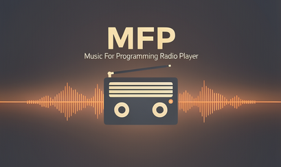

# MFP — Music For Programming Player

Lightweight Rust terminal player for [musicforprogramming.net](https://musicforprogramming.net/).
It streams the episodes directly, shows a live audio visualizer, supports
color themes, and can be controlled with your desktop media keys (MPRIS).

**[→ Full documentation (keys, visualizer, themes, configuration)](https://4DRIAN0RTIZ.github.io/mfp/)**



```text
┌ Episodes ───────────┐┌ Now playing ─────────────────────┐
│  Episode 74         ││ Episode 75                       │
│▶ Episode 75         ││ ━━━━━━━━━━━────────  12:04/58:20 │
│  Episode 76         ││ ▁▃▅█▇▅▃▂▃▅▆▄▂▁  (visualizer)     │
└─────────────────────┘└──────────────────────────────────┘
```

## Install

```bash
git clone https://github.com/4DRIAN0RTIZ/mfp && cd mfp
cargo build --release
sudo cp target/release/mfp /usr/local/bin/  # optional
```

## Usage

`mfp` opens a full-screen terminal UI by default. Running `mfp` with no
subcommand is the same as `mfp play` and accepts the same options.

```bash
mfp                 # start the player
mfp play -e 75      # start at a specific episode
mfp play -s         # shuffle
mfp play -f         # favorites only
mfp play --compact  # start with the episode list hidden
mfp play --plain    # plain text mode (typed commands)
mfp list            # list all episodes
mfp fav -l          # manage favorites (-a / -r to add / remove)
mfp download -e 75  # manage offline downloads
```

Run `mfp --help` or `mfp play --help` for details.

## Essential keys

| Key | Action | Key | Action |
|-----|--------|-----|--------|
| `n` / `b` | Next / previous episode | `p` | Pause/resume |
| `+` / `-` | Volume up / down | `m` | Mute |
| `s` | Toggle shuffle | `f` | Toggle favorite |
| `h` | Hide/show the episode list | `v` / `V` | Next visualizer style / on-off |
| `Up`/`Down`, `j`/`k` | Move selection | `Enter` | Play the selected episode |
| `/` | Search episodes | `q`, `Ctrl+C` | Quit |

## Visualizer and themes

The player draws a live audio visualizer in six styles (`bars`, `mirror`,
`wave`, `dots`, `area`, `vu`) and ships six color themes (`default`,
`solarized`, `high-contrast`, `gruvbox`, `nord`, `dracula`). Both are chosen in
the optional `~/.config/mfp/config.toml`, which mfp only reads and never
writes. Custom themes, every key and all the details are documented on the
[landing page](https://4DRIAN0RTIZ.github.io/mfp/).

## License

GPL-3.0
